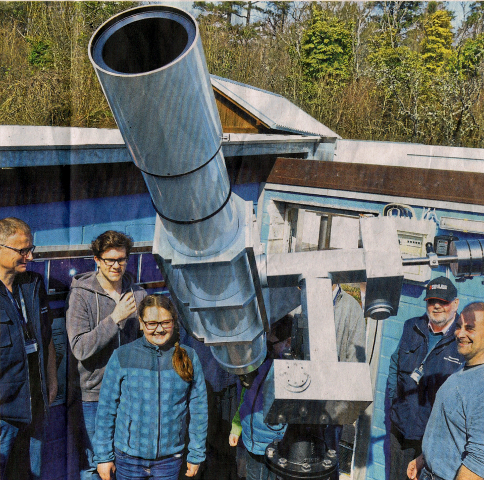

Unser diesjähriger Astronomietag war ein voller Erfolg.

Das Wetter hatte ein Einsehen und zeigte sich von der besten Seite.  
So konnten wir unseren sehr interessierten Besuchern – ca. 250 an der Zahl – einen Einblick in die Arbeitsweise der Sternwarte geben.   
Die Sonne war im Weißlicht, leider nur ein winziger Sonnenfleck, und H-Alpha Licht, mit einigen Protuberanzen, zu bewundern.  



Bei Einbruch der Dunkelheit hatten wir unsere Teleskope auf die markantesten Objekte, ausgerichtet. Von vielen Besuchern war ein Staunen zu hören, oder "das hab ich ja so noch nie gesehen" zu vernehmen.  
Bis spät in die Nacht wurde über die verschiedensten astronomischen Themen philosophiert und diskutiert.

Vielen herzlichen Dank allen Besuchern für diesen schönen Tag. Es hat uns eine Menge Spaß gemacht und wir hoffen Sie bald wieder auf der Sternwarte begrüßen zu können.

Ihr Team von der Sternwarte Bad Kreuznach.

## Zeitraffer

Ein Zeitraffer von ca. 2 Minuten zeigt die Besucher auf unserem Gelände.  
Aufnahmedauer ca. 6 Stunden, von 12:42 bis 19:21 Uhr.




Der elfjährige Leo fand den Blick durch die Teleskope spannend. Der Schüler hatte viele Fragen, die ihm auf der Sternwarte unter anderem von den Vereinsmitgliedern Andreas Metzen (links) und Rainer Kesper (2.v.l.) beantwortet werden konnten.  
Foto: Sonja Flick

## Presseberichte zum Astronomietag 2017 

### Allgemeine Zeitung Bad Kreuznach vom 31. März 2017

**Gefilterter Blick in die Sonne**  
Von Sonja Flick 

BAD KREUZNACH - Besser hätte der diesjährige Astronomietag kaum laufen können. Neben etwa 250 interessierten Besuchern aller Altersgruppen präsentierte sich vor allem die Sonne als Hauptakteurin von ihrer besten Seite und ließ die Sternwarte Bad Kreuznach in einem herrlichen Frühlingslicht erstrahlen. 

Wer am Astronomietag durch das H-alpha-Teleskop auf dem Kuhberg schaute, konnte ein völlig anderes, fürs bloße Auge nicht wahrnehmbares Gesicht der Sonne entdecken. Dieses Teleskop wurde speziell zur Beobachtung der Sonne entwickelt und ist mit einem Interferenzfilter ausgestattet, der die Sonnenstrahlung nur in einem schmalen Spektralbereich durchlässt. Das Zentralgestirn unseres Planetensystems erscheint im H-alpha-Licht in einem satten Orange und zeigt neben den Sonnenflecken besonders deutlich die Sonnenfackeln, am Sonnenrand die größeren Protuberanzen, die sonst nur während einer totalen Sonnenfinsternis zu sehen sind. 

Das fand sogar der elfjährige Leo interessant. Eigentlich interessiere er sich nicht so sehr für das Thema Astronomie, erzählte der Schüler, aber den Blick durch die riesigen Teleskope auf die Sonne fand er trotzdem sehr spannend und vertiefte Vereinsmitglied Andreas Metzen auch gleich in ein intensives Gespräch über den glühend heißen Stern und die sehr gut zu erkennenden Protuberanzen. 

Neben visuell fast schon künstlerisch anmutenden Bildershows und interessanten und informativen Beiträgen über die Entstehung des Sonnensystems, die Astrofotografie und den Mond, wurde natürlich zwischendurch auch viel über astronomische Themen philosophiert und diskutiert. Hier und da kam dabei die ein oder andere Anekdote ans Tageslicht. Die rund 40 Mitglieder, zu denen sich im Laufe der Veranstaltung noch einige hinzugesellt haben, widmen sich ihrem Hobby mit Herzblut. Da wird, um den ehelichen Frieden beizubehalten, schon gerne mal ganz romantisch in die Trickkiste gegriffen. Wenn Vereinsmitglied Rainer Kesper seine Frau zu einem lauschigen Picknick mit Grill und Kuscheldecke einlädt, ist der Gemahlin inzwischen klar, dass ihr Gatte sie auf den Kuhberg entführt und für das stimmungsvolle Licht der Mond und die Sterne zuständig sind. 

**Erdbeerkuchen verschwindet in Lichtgeschwindigkeit**

„Es ist schon ein spannendes Hobby, wenngleich ich gestehen muss, dass ich nicht immer alles erkenne, was mir mein Mann da alles am Himmel zu zeigen versucht“, schmunzelte die Gattin. Auf die Frage „Siehst du den Schwan?“ bekommt Rainer Kesper dann schon mal ein klassisches „Nö“ von seiner Frau zu hören. Für das leibliche Wohl hatten die Mitglieder der Sternwarte Bad Kreuznach ebenfalls vortrefflich gesorgt. Besonders der leckere Erdbeerkuchen hatte es den Gästen angetan und war in Lichtgeschwindigkeit aufgegessen. 

### Öffentlicher Anzeiger Bad Kreuznach vom 29. März 2017 

**Raketenstarts und die Weiten des Weltalls**

**Astronomie** Frühlingssonne beschert volle Sternwarte

Auf großes Interesse stieß der Astronomietag am Samstag in der Sternwarte Bad Kreuznach.  
Foto: Josef Nürnberg

Von unserem Reporter Josef Nürnberg

BAD KREUZNACH

In den Weiten des Weltalls sind die Mitglieder der Sternwarte Bad Kreuznach schon lange zu Hause.  
Nun sind sie auch im Internet - und zwar bei Facebook - angekommen. Hierin sieht Bernd Peerdeman auch eine der Gründe für den guten Besuch der Sternwarte zum bundesweiten Astronomietag am vergangenen Samstag. Der zweite Grund, warum am Samstag zwischen 13:30 Uhr und 23:00 Uhr rund 250 Sternen- und Sonnenfreunde die Sternwarte besuchten, war der Frühling. "Nach fünf Jahren mit schlechtem Wetter hatten wir endlich wieder bestes Wetter", war der Vorsitzende mit dem Tag voll und ganz zufrieden. Freude kam auch auf, weil Dr. Thomas Kessler, seit vergangenem Jahr Geschäftsführer der Optischen Werke Bad Kreuznach, mit seinem Sohn vorbeischaute, denn das Bad Kreuznacher Unternehmen unterstützt die Sternwarte.

**Das Motto: "Sehenswertes an der Sonnenbahn"**
 

Im Mittelpunkt stand am Samstag die Sonnenbeobachtung. Die strahlte bekanntlich über beide Backen - möglicherweise ob der großen Aufmerksamkeit, die man ihr unter dem Motto "Sehenswertes an der Sonnenbahn" schenkte. So stand eigentlich alles im Mittelpunkt, was sich so an der Sonnenbahn so tummelte. Wobei die Mitglieder der Bad Kreuznacher Sternwarte nicht nur mit ihren fantastischen Teleskopen beeindruckten, sondern auch mit ihrem großen Fachwissen. Doch das ist noch nicht alles. Den Vereinsmitgliedern gelang es auch ganz ausgezeichnet, dieses fundierte Wissen in ihren Vorträgen den interessierten Laien leicht verständlich zu vermitteln. Die Mischung aus Entdecken und Wissen machte denn auch die Spannung aus.  
So erlebten die Besucher ein spannendes Programm mit Kurzvorträgen, Beobachtung der Sonne in verschiedenen Wellenlängen und Raketenstarts auf der benachbarten Drachenwiese. Weil ein Ausflug in die Weiten des Weltalls auch hungrig macht, hatten die Mitglieder der Sternwarte bestens für das leibliche Wohl gesorgt. Peerdeman zog am Ende ein positives Fazit: "Es war schon faszinierend zu erleben, wie begeistert die Besucher waren."