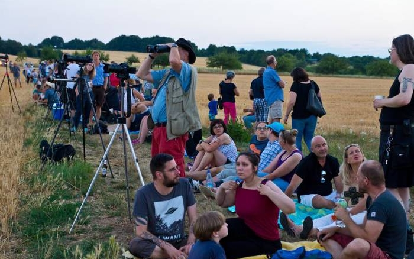
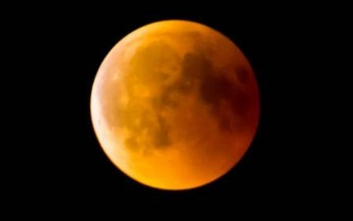

## SWR Aktuell vom 28. Juli 2018 um 19:30 Uhr



Mit freundlicher Genehmigung vom SWR-Fernsehen



Schätzungsweise 2.500 interessierte Besucher haben dieses Naturschauspiel mit uns im Bereich des [Vinorant Rosenhof](https://www.vinorant-rosenhof.de/) verfolgt.  
Vielen Dank an [Jens Henkel](http://jhmusic.de/) für dieses Video.

## Mondfinsternis wird zum Volksfest – 2000 Besucher folgen der Einladung der Sternwarte Bad Kreuznach
*Allgemeine Zeitung Bad Kreuznach 30.07.2018*

  
Auf den Stoppelfeldern rund um den Rosenhof warten die Mondsüchtigen auf das große Himmelsspektakel. Die Veranstalter von der Sternwarte sind völlig überrascht: Mit 2000 Besuchern hatte niemand gerechnet.  
Foto: Wolfgang Bartels

  
Foto: Wolfgang Bartels
Es dauert ein wenig, bis die kupferrote Diva aus dem Dunst herauskommt und auf der großen Bühne des Nachthimmels erscheint.   

*Von Wolfgang Bartels*

BAD KREUZNACH - Die rote Diva lässt auf sich warten. Zu sehen ist erst einmal gar nichts. Nur ganz langsam schiebt sie sich aus dem Dunstvorhang über dem Horizont heraus auf die große Himmelsbühne. Dafür hat sie ihren kleinen, ebenfalls rot leuchtenden Begleiter schon einmal vorgeschickt. Totale Mondfinsternis mit dem Planeten Mars im Gefolge über den Stoppelfeldern des Rosenbergs im Bad Kreuznacher Süden.

Die Sternwarte Bad Kreuznach hat eingeladen, auf dem Parkplatz der „Vinothek Rosenhof“ den „astronomischen Sommernachtstraum“ mitzuerleben. Doch der Parkplatz erweist sich als viel zu klein, um die Menschenmassen zu fassen. Mit gut 500 Besuchern hat Sternwarten-Chef Bernd Peerdeman gerechnet, am Ende sind es mehr als 2000, die sich mit Decken und Campingstühlen auf den gerade rechtzeitig abgeernteten Feldern niedergelassen haben. Es herrscht regelrechte Volksfeststimmung – und alles wartet auf den Hauptdarsteller. Die Panzerstraße und alle Feldwege ringsum sind zugeparkt. Peerdeman: „Wir hätten nie gedacht, dass es so viele Mondsüchtige gibt. Das hier ist eine absolute Premiere für uns.“

### Nächste Finsternis  
Die nächste totale Mondfinsternis ereignet sich bereits am 21. Januar 2019, wird aber gerade 62 Minuten dauern. Auf eine mit 106 Minuten ähnlich lange Mondfinsternis wie jetzt wird man bis zum 9. Juni 2123 warten müssen. Und der „astronomische Sommernachtstraum“, die Mondfinsternis in Begleitung des Planeten Mars, wird sich erst in 105 000 Jahren wiederholen.

Roman Schneider von der Sternwarte hat ein riesiges Teleskop aufgebaut: Brennweite 1600 Millimeter und eine Öffnung von 35 Zentimetern. Geduldig erklärt er den Gästen, wie das Ding funktioniert. Später, wenn die rote Diva endlich so weit ist, darf jeder mal den vergrößerten Blick auf die Himmelserscheinung riskieren. Sonja Huster aus Nieder-Hilbersheim lagert mit ihrer Familie auf einer Decke: „Unsere sechsjährige Mara interessiert sich für den Mond und die Sterne. Deswegen warten wir begeistert.“ Michael Schmorl aus Bad Kreuznach meint: „Wir haben so etwas noch nie in unserem Leben erlebt und werden das auch nicht mehr erleben. Wir hätten heute Abend auch zu einem Rockkonzert gehen können. Aber wir wollten uns einfach etwas ganz Ruhiges anschauen.“ Sebastian Klein aus Sprendlingen hat seine Fotoausrüstung samt 480-Millimeter-Objektiv und Stativ mitgebracht: „Ich hoffe auf gute Fotos.“

Dann, ganz langsam, gibt sich die rote Diva zu erkennen. Sie steht schon ziemlich hoch am Horizont über den Weinbergen, als der Dunst endlich den Blick auf die kupferrote Scheibe des „Blutmonds“ freigibt. In diesem Moment fliegt auch noch die ISS über den Himmel. Winken für unseren Astronauten Alexander Gerst. Doch der hat offenbar Probleme, das Ereignis mit der Kamera zu bannen. Er twittert: „Gerade ein Foto von der Mondfinsternis gemacht. Schwierig einzufangen.“ Dieses Schicksal teilt er mit all den Hobbyfotografen, die auf den Äckern rund um den Rosenhof versuchen, scharfe, große Bilder vom Kupfermond zu bekommen.

Sternwarten-Chef Peerdeman erklärt am Teleskop, wie eine Mondfinsternis funktioniert: „Die Erde schiebt sich zwischen Sonne und Mond. Der Schatten, den dabei die Erde wirft, verdunkelt den Mond. Solange der Mond vollständig vom Erdschatten bedeckt wird, herrscht die totale Mondfinsternis.“ Doch ganz verschwindet der Mond nicht: Das Sonnenlicht bricht sich an der Erdatmosphäre: „Die langwelligen Anteile des Lichts lassen den Mond in einem roten Glanz erscheinen.“ Und dann malt sich Peerdeman aus, wie er das Ereignis als Gast auf dem Mond erleben würde: „Von dort würde ich eine Sonnenfinsternis sehen. Die Erde schiebt sich vor die Sonne, und da die Erde von der Atmosphäre umgeben ist, hätte sie einen orange-roten Rand.“ Doch der Sternenfreund ist wie alle anderen der 2000 Besucher auch mit dem Blick von der Erde aus auf die kupferrote Scheibe völlig zufrieden. Langsam, aber sicher, nach langen 103 Minuten totaler Finsternis, wird der Mond wieder gelblich-weiß und beginnt, nach und nach in den gewohnten Farben des Vollmonds zu leuchten.