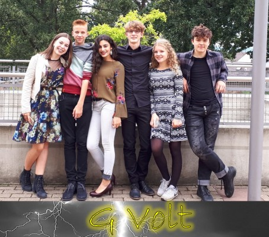

**Faszination Weltraumforschung und Astronomie**  
Die Sternwarte Bad Kreuznach präsentiert die Astro Night 2019.

Zur Stärkung vor der Reise in die Weiten des Weltalls beginnt das Event mit einem Sektempfang und Fingerfood. Dann starten wir mit Kurzvorträgen zu aktuellen Themen.

Unsere erfahrenen Referenten zeigen Ihnen Science-Fiction die Realität ist und wird, neuste Entdeckungen der Weltraumforschung, die Schönheit unseres Universums und noch viele weitere Themen. Atemberaubende Videosequenzen bringen einen Kino-Flair in die Vorträge und Veranstaltung.  
Zu gewinnen gibt es auch etwas bei der Teilnahme an unseren Astro Games 2019. Der Hauptgewinn ist ein 6" Newton Teleskop! Musikalische Beiträge der Band G-Volt werden der Veranstaltung eine passende akustische Atmosphäre geben.  
Wenn es das Wetter zulässt bieten wir nach der Veranstaltung noch live Sternenbeobachtung auf der Terrasse an.

**Freuen Sie sich auf einen Abend der Faszination Weltraum und Astronomie.**



### Wo?  
**[Haus des Gastes](https://www.bad-kreuznach-tourist.de/kultur-geniessen-und-einkaufen/haus-des-gastes/)**  
im Rudi Müller Saal  
Kurhausstraße 22-24  
55543 Bad Kreuznach

**[Veranstaltungskalender Bad Kreuznach](https://www.bad-kreuznach-tourist.de/kultur-geniessen-und-einkaufen/veranstaltungen/online-veranstaltungskalender-bad-kreuznach/details/event/astro-night-2019-faszination-weltraum-und-astronomie-2019-10-19/)**

### Wann?
Samstag, 19. Oktober 2019  
18:30 bis 22:00 Uhr  
Barrierefreier Zugang  
Einlass: 18:00 Uhr

---

## Unser Programm: 

- Begrüßung durch den 1. Vorsitzenden: Vorstellung der Sternwarte
- Pop-Song Cover der Band G-Volt
- Marsexploration - Multiplanetarische Spezies Mensch! - Referent: Andreas Metzen
    - Der Mars und warum?
    - SpaceX, Elon Musk
    - Falcon 9 & Heavy, Dragon, Starship
    - Ist die eben gelandet?
    - Ryanair des Weltraums
    - Marskolonie
    - Jenseits des Mars
- Hubble auf Erden – Astrofotografie - Referent: Mehmet Ergün
- Schwerlos-Pause (Getränke- & Brezel-Verkauf), Astro Games Teilnahme
- Pop-Song Cover der Band G-Volt
- Journey into Space – Raumfahrtspezies Menschheit - Referent: Andreas Metzen
    - Das große Geschäft – Weltraumfahrt
    - Weltraumticket gefällig?
    - Mann im Mond
    - Marsmännchen – NASAs Pläne
- Aktuelle Weltraummissionen und Entdeckungen - Referent: Andreas Metzen
    - Internet für Alle und Überall
    - Aktuelle NASA Missionen
    - M87 Instagram Bild des Jahres
    - Die Frau im Mond
- Pop-Song Cover der Band G-Volt
- Astro Games Verlosung und Bekanntgabe der Gewinner
- Live Sternenbeobachtung auf der Terrasse (bei entsprechenden Wetterbedingungen)

## Tickets:  
Kartenvorverkauf: 7,50€  
Abendkasse: 10,00€  
Jugendliche bis 16 Jahren: 5,00€  
[www.ticket-regional.de](https://www.ticket-regional.de/sternwartebk)  
  
[Tourist-Information Bad Kreuznach](https://www.bad-kreuznach-tourist.de/tourist-information/tourist-information-bad-kreuznach/)  
Tel.: 0671-8360050  

---

Musikalische Beiträge der Band **G-Volt**

---

Sollten Sie die Parkmöglichkeiten am Kurhaus / Fürstenhof nutzen, dann können Sie gegen Vorlage Ihres Parktickets ein Ausfahrticket für 3€ an der Getränketheke erhalten.
  
**Bitte keine Getränke und Essen mit in den Saal bringen.**