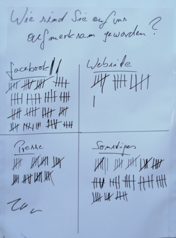
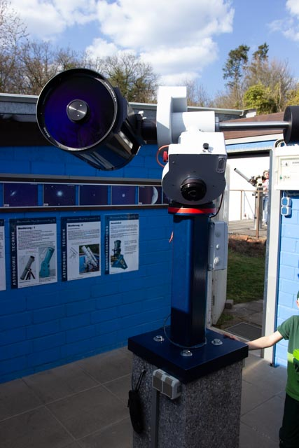

Bei strahlendem Wetter konnten wir **ca. 500 Besucher** zu unserem Astronomietag begrüßen. Im Weißen- und H-Alpha Licht war unsere Sonne der „Star“ am Himmel.







Mit unseren Kurzvorträgen über...

- Astrofotografie – M. Ergün
- Die Software „Stellarium“ – B. Peerdeman
- Zirkumpolar Sternbilder – R. Frey
- Himmelsbeobachtung mit einfachen Mitteln – J. Bock
- Teleskopkaufberatung – B. Peerdeman



... konnten wir unseren Besuchern ein abwechslungsreiches Programm anbieten.

### Wie sind Sie auf uns aufmerksam geworden?

Anhand von vier Kriterien hatten unsere Besucher die Wahl.

## SWR berichtet

Den ganzen Tag hat uns ein Fernsehteam vom SWR begleitet und einen interessanten Bericht zusammengestellt.



Eine großartige Werbung für die Sternwarte - mit freundlicher Genehmigung vom SWR.

## Einweihung der neuen Montierung

Das Highlight des Tages war die Einweihung unserer neuen Sternwarten-Montierung vom Typ Fornax 102 mit Schmidt-Cassegrain 12“ Meade LX 200 emc.

## Raketenstarts

Nicht zu vergessen: Unsere beim Publikum sehr beliebten Raketenstarts.

Abends, bei guten Wetterbedingungen, hatten wir sehr viele Besucher an unseren Teleskopen. Die Gespräche mit den Besuchern sind dabei am interessantesten. Neben dem Mars, den Plejaden, Alkor und Mizar war M 42 _das Objekt_ am Abend.

Um 20:53 Uhr hatten wir das Glück, die ISS beim Überflug über die Sternwarte zu bewundern.

Ein gelungener Tag.  
**Vielen Dank an alle Beteiligten**

## Artikel in der Allgemeinen Zeitung Bad Kreuznach vom 04.04.2019

**Astronomietag der Sternwarte in Bad Kreuznach**  
Von Wolfgang Bartels

Gut 500 Besucher erlebten den Astronomietag in der Sternwarte auf dem Kuhberg. Der Verein stellte das neue Teleskop vor – und warnte vor der Lichtverschmutzung durch die Städte.



Foto: Wolfgang Bartels

Neugierige Besucher auf der Sternwarte lassen sich das neue Teleskop mit einer Brennweite von drei Metern von Bernd Peerdeman (rechts) erklären.  
Tagsüber kann man damit die Sonne beobachten, nachts in die Tiefen des Universums blicken.

BAD KREUZNACH  
„Im Moment ist nicht viel los auf der Sonne. Keine Flecken, keine Eruptionen, völlige Ruhe.“ Trotzdem ist Bernd Peerdeman mächtig stolz auf das neue Teleskop, das auf die Sonne ausgerichtet ist – selbstverständlich mit den notwendigen Schutzfiltern, damit die Augen keinen Schaden davontragen. Anlässlich des Astronomietages stellt die Sternwarte auf dem Kuhberg ihr neuestes Gerät vor: ein Teleskop mit einem Zwölf-Zoll-Spiegel und einer Brennweite von drei Metern.  
Der Beobachter muss das Teleskop auf einen bekannten Stern einstellen, dann sorgt die Montierung computergesteuert dafür, dass das Teleskop den Sternenbahnen folgt, indem sie die Erddrehung ausgleicht.  
Peerdeman, Vorsitzender des Sternwarten-Vereins, zeigt den zahlreichen Besuchern, die sich im Laufe des Nachmittags und des Abends einfinden, wie das neue Gerät funktioniert. In der Nacht lassen sich damit die Sterne beobachten, vorausgesetzt, der Himmel ist wolkenfrei, was aber an diesem ersten richtigen Frühlingstag der Fall ist. Gut 500 Besucher lassen sich von Peerdeman und seinen Kollegen zeigen, was es heißt, wenn er sagt: „Wir können jetzt noch tiefer ins Universum hineinschauen.“ Funkelnde Sterne, großartige Nebel und die Überreste von Sternexplosionen sind dort zu sehen.

Im Laufe von drei Jahrzehnten hat sich auf dem Kuhberg neben dem alten Schloss Rheingrafenstein eine der größten und bestausgestatteten Sternwarten im weiten Umkreis entwickelt. Das Besondere ist, dass sie von einem Verein betrieben wird und nicht etwa von der öffentlichen Hand oder einem wissenschaftlichen Institut.

Am späteren Nachmittag setzt sich ein Trupp zu Fuß zur Drachenwiese auf dem Kuhberg in Bewegung. Ein beliebter Aktionszweig auf der Sternwarte ist nämlich das Raketenbasteln, für das sich vor allem Jugendliche begeistern. Auf der Wiese werden die 40 Zentimeter hohen Flugkörper bis zu 100 Meter in den Himmel geschossen – eine Aktion, die den Teilnehmern mächtig Spaß bereitet: „Unser kleines Cape Canaveral auf dem Kuhberg“, wie einer der Jugendlichen sagt. Im Seminarraum gibt es allerlei Vorträge zum Sonnensystem, über den Mond und die Astrofotografie. Gesprächspartner des Vereins stehen überall bereit, um die Besucher in die Geheimnisse der Astronomie einzuweihen.

Ein großes Problem für die Astronomen ist allerdings die zunehmende nächtliche Lichtverschmutzung des Himmels. Dazu erklärt Bernd Peerdeman: „Je heller der nächtliche Himmel aus unseren Städten und Siedlungen angestrahlt wird, umso schwieriger wird es, die Sterne oder gar die komplette Milchstraße zu erkennen.“ Unter dem Motto „Licht aus, Sterne an“ will der Astronomietag auch dieses Thema ins Bewusstsein rücken. Dabei sind die Astronomen gar nicht gegen die Straßenbeleuchtung. Sie weisen nur daraufhin, dass es heutzutage moderne Beleuchtungssysteme gibt, die das Licht auf die Straße werfen und nicht in den Himmel. Je schwärzer sich der Nachthimmel über dem Kuhberg präsentiert, desto mehr Sterne sind zu entdecken. Mittlerweile kann man dort mit fünf Teleskopen das Weltall absuchen, und Bernd Peerdeman ist mit Begeisterung bei der Sache: „Das Universum – das ist das Spannendste, was es gibt.“
