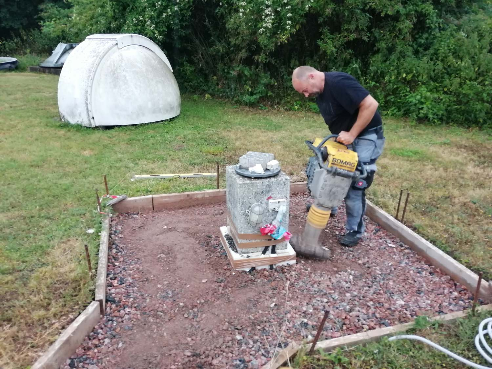
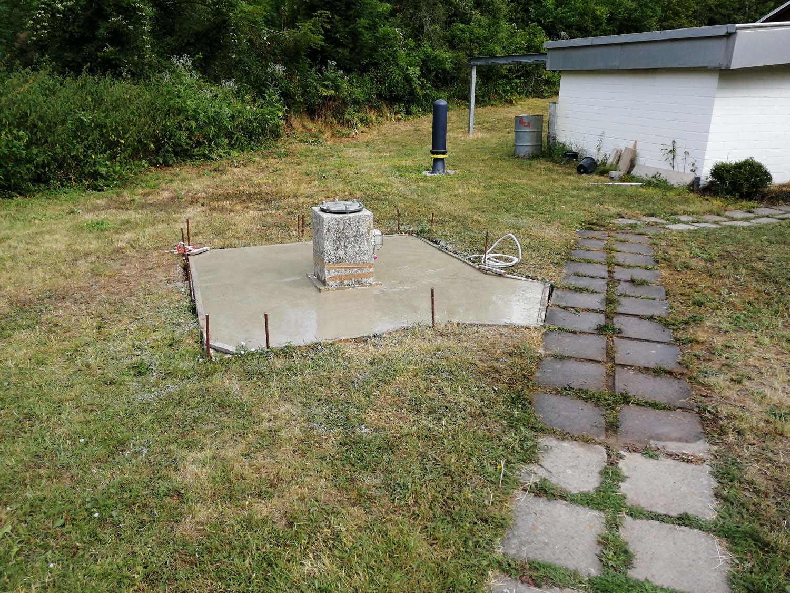

Unsere neue Sternwarte für die Astrofotografie ist fertig.
Nach langer Planungsphase waren wir bereit für den Bau.  
Bauzeit: Von April 2019 bis Oktober 2020.

Die folgende Fotostrecke zeigt, wie unsere 4. Sternwarte entstanden ist.

Der Standort für den Kuppelbau war gewählt. Eine seit vielen Jahren ungenutzte Granitsäule war perfekt geeignet.

Zunächst mussten Gehwegplatten ...

... Splitt ...

... und Erdreich entfernt werden.

Filtermaterial musste herangeschafft ...

... und eingebracht werden.

Zum Verdichten noch mit der Rüttelplatte drüber.

Der Estrichbeton liegt bereit ...

... und wird von uns eingebaut.

Eine große Hilfe war unsere "Hightech" Mischmaschine.

An einem Nachmittag war das Fundament fertig.

Als nächster Schritt wurde das verzinkte Untergestell für die Kuppel montiert.

Hier ist sie vor ...

... und nach der Reinigung zu sehen. Kaum wiederzuerkennen erstrahlt sie im neuen Glanz.

Auf das Untergestell kommt zunächst die Kuppelbasis und ...

... anschließend wird die 2,10m Baader Planetarium-Kuppel...

... mit vereinten Kräften aufgesetzt.

Es war geschafft. Die Kuppel war drauf.

Die Kuppel war ein "Schnapper" aus einem Nachlass.

Eine sehr stabile Säule ...

... mit Ablagefläche ...

... wurde für unsere Fornax 52 installiert.



Abendliche Impressionen mit aufgesetzter Kuppel.

Die Eingangstür aus Stahlrohr entsteht.

Hier ist sie verzinkt und montiert im Untergestell zu sehen.

Jetzt noch die Außenverkleidung.

Es ist vollbracht. Da steht sie, bereit für ihre Aufgaben.

Vielen herzlichen Dank an alle Beteiligten.
