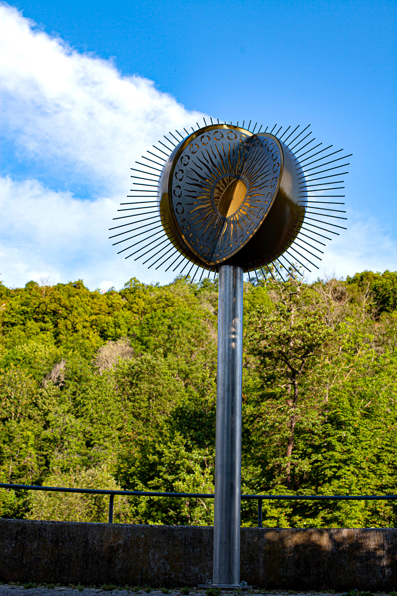

Dank der großzügigen Unterstützung vieler Spender konnten wir die in die Jahre gekommene Sonnenskulptur restaurieren lassen und präsentieren sie nun wieder am gewohnten Standort. Zu diesem Anlass möchten wir uns recht herzlich bei allen Spendern bedanken und laden diese recht herzlich zur Einweihung ein:

Die Einweihung für die Spender findet am  
**Freitag, 16. Juli 2021**  
**um 14:00 Uhr**  
**am Standort Roseninsel statt.**

Die Arbeiten wurden gemäß der künstlerischen Gestaltung von Herrn Gernot Meyer-Grönhof von den Firmen Pulver Fischer, Bad Kreuznach und MST-Graffe GmbH Maschinen und Stahlbautechnik, Langenlonsheim ausgeführt.

