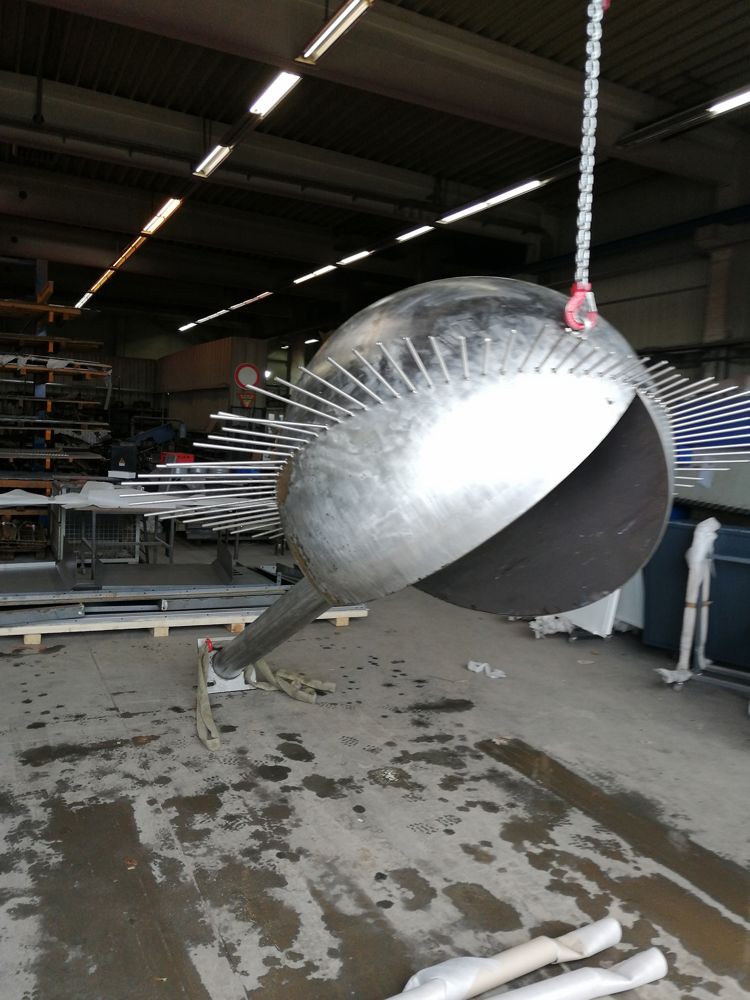

Seit 2002 steht die Sonnenskulptur an ihrem Platz auf der Roseninsel und erfreut sich größter Beliebtheit. Durch Witterungseinflüsse hatte sich das Aussehen der Sonnenskulptur sehr stark verändert.

Der Urzustand um 2002

Nach ca. 18 Jahren harter Witterung ...

... war die innere Struktur verblichen, der Lack abgeblättert und die Strahlen verbogen.

---

### Spendenaktion „Rettet die Sonne“

Der Sternwarte war es ein Anliegen, diesen Missstand an einer der Sehenswürdigkeiten der Stadt Bad Kreuznach zu beseitigen. Es wurde die Spendenaktion „Rettet die Sonne“ ins Leben gerufen, und innerhalb kürzester Zeit kamen so ca. 3.000 EUR zusammen.

Mit dem Kran begannen die Arbeiten zur Restaurierung

Bereit zum Pulverbeschichten

Die Restaurierungsarbeiten wurden von Februar bis Juli 2021 vorgenommen und gemäß der künstlerischen Gestaltung von Herrn Gernot Meyer-Grönhof durch die Firmen Pulver Fischer, Bad Kreuznach und MST-Graffe GmbH Maschinen und Stahlbautechnik, Langenlonsheim ausgeführt.

Die restaurierten Bleche mit der neuen inneren Struktur aus Edelstahl sind fertig...

...und sind nun wieder mit der nun pulverbeschichteten Sonnenskulptur vereinigt.

Nach der Restauration, mit dem Kran, zurück auf der Roseninsel.

Nach umfangreichen Restaurierungsarbeiten erstrahlt die Sonnenskulptur am Beginn des Planetenwegs der Sternwarte Bad Kreuznach e.V. wieder in neuem Glanz

Da steht sie wieder.

---

Am Freitag, den 16. Juli 2021 wurde die Sonnenskulptur der Öffentlichkeit präsentiert.

Praktikantin von G. Meyer-Grönhof, Klaus Evers (Rotary-Club Bad Kreuznach), Gernot Meyer-Grönhof sowie Reinhold Frey, Bernd Peerdeman, Werner Dennhardt von der Sternwarte Bad Kreuznach e.V.

Filialleiter Adrian Hennen (re) v.d. Volksbank Rhein-Nahe

Eine Schönheit erstrahlt im neuen Glanz

Unser herzlichster Dank geht an alle Spender, die diese Restaurierung ermöglicht haben.
