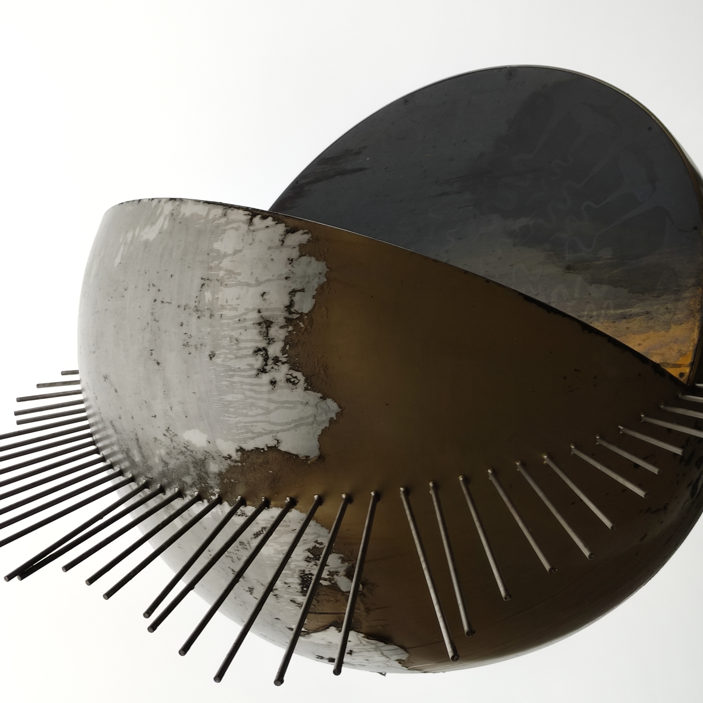
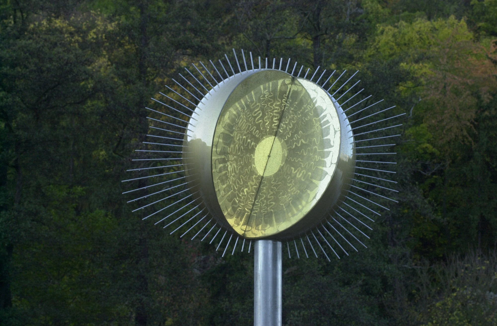

Spendenaufruf - Unsere Sonne benötigt Ihre Hilfe!

Seit vielen Jahren ist der Planetenweg der Sternwarte Bad Kreuznach e.V. ein fester Bestandteil der Sehenswürdigkeiten der Stadt Bad Kreuznach geworden und erfreut sich großer Beliebtheit. Durch Umwelteinflüsse hat sich die Oberfläche unserer Sonne sehr stark verändert und dadurch ihren Glanz verloren. Dieser Zustand ist nicht länger tragbar und wir wollen daher die Instandsetzung in Angriff nehmen.

Auch an uns ist COVID-19 nicht spurlos vorüber gegangen. Uns fehlen sämtliche Einnahmen aus 2020 und umso schwerer ist es, für die Kosten der Restaurierung aufzukommen.

Dies ist der Anlass, Sie um Mithilfe bei der Instandsetzung dieser Sehenswürdigkeit zu bitten.

Bitte unterstützen Sie uns bei diesem Projekt.

---

Ihre Spende richten Sie bitte an:

**Volksbank Rhein-Nahe-Hunsrück eG**  
IBAN: `DE14 5609 0000 0007 1231 34`  
BIC:  `GENODE51KRE`  

oder auf unser PayPal-Konto: [info@sternwarte-kreuznach.de](https://www.paypal.com/donate/?hosted_button_id=824GDMD9MRET8)

---

Die Umwelteinflüsse haben ihr doch sehr zugesetzt.

Kein schöner Anblick.

Als Sehenswürdigkeit der Stadt Bad Kreuznach nicht länger hinnehmbar.

---

So soll unsere Sonne bald wieder erstrahlen.
