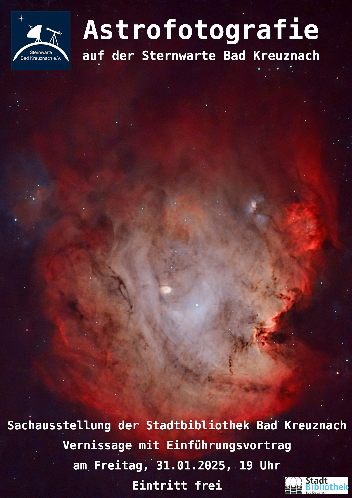

Die Sternwarte präsentiert ab dem **31. Januar 2025** in Zusammenarbeit mit der Stadtbibliothek Bad Kreuznach eine Fotoausstellung mit dem Thema **Astrofotografie**.

Sie können dort 30 Fotos mit astronomischen Motiven bewundern, die von Mitgliedern der Sternwarte aufgenommen wurden. **Der Eintritt ist frei**.

Die Exponate können käuflich erworben werden, wobei der Erlös hieraus dem Ausbau der Sternwarte zugutekommt.

Als Auftakt findet am **31. Januar ab 19 Uhr** eine Vernissage mit einem feierlichen Eröffnungsvortrag in den Räumlichkeiten der Stadtbibliothek statt.

Wir laden Sie recht herzlich zum Besuchen der Ausstellung ein und würden uns freuen, wenn Sie auch an der Eröffnungsveranstaltung teilnehmen.

Die Ausstellung bleibt bis zum **22. März** geöffnet.

