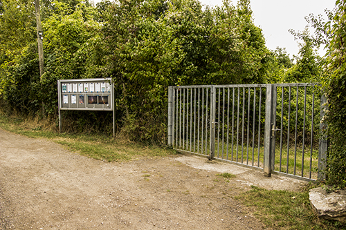


**Mail**: [info@sternwarte-kreuznach.de](mailto:info@sternwarte-kreuznach.de "info@sternwarte-kreuznach.de")

Aufgrund der hohen Nachfrage bitten wir Sie, Ihre Anfragen ausschließlich an diese E-Mail-Adresse zu richten.


**1. Vorsitzender:**  
Roland Zahn

**2. Vorsitzender:**  
Johannes Lind

**Schriftführer:**  
Bernd Peerdeman

**Kassenwart:**  
Reinhold Frey

**Beisitzer:**  
Markus Behrwanger

### Bankverbindung

**Volksbank Rhein-Nahe-Hunsrück eG**  
IBAN: DE14 5609 0000 0007 1231 34  
BIC: GENODE51KRE

### Adresse

An der Sternwarte 2  
55543 Bad Kreuznach

### Postanschrift

Sternwarte Bad Kreuznach e.V.  
c/o Roland Zahn  
Saarstraße 14  
55283 Nierstein

---

# Anfahrt

### Mit dem Auto

1. Aus Bad Kreuznach kommend, folgen Sie dem Verlauf der Rheingrafenstraße am Tierheim vorbei bis zum Kuhberg.
2. Aus Richtung Hackenheim oder Wöllstein (L 412) kommend, biegen Sie nach dem Kreisel nach links auf die Panzerstraße ein.

Vor dem Restaurant „Hofgut Rheingrafenstein“ folgen Sie der Beschilderung nach rechts in Richtung „Sternwarte“.  
Parkplätze finden Sie vor dem „Schloß Rheingrafenstein“. Nehmen Sie den linken Weg und nach ca. 200 Metern Fußweg sind Sie am Ziel.

