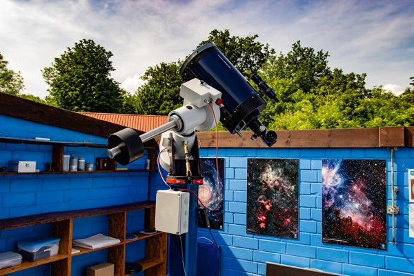
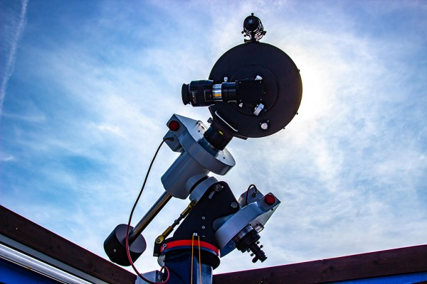
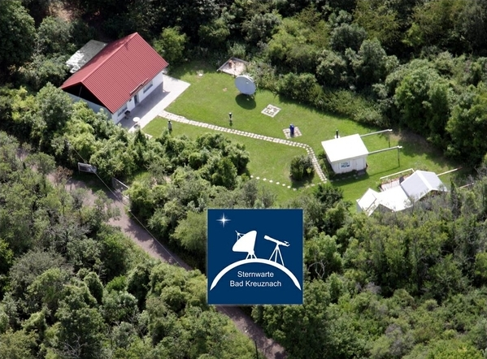
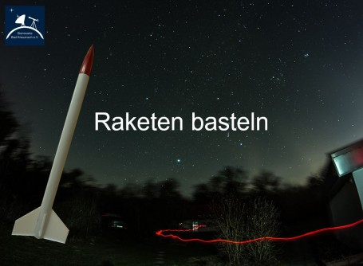
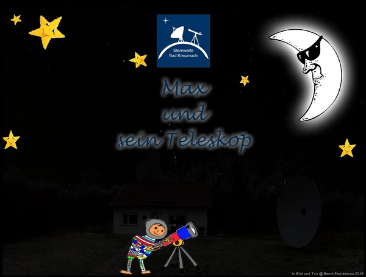
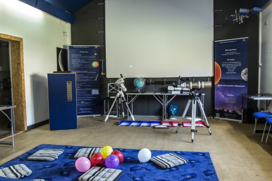

##  Wir zeigen Ihnen die Schönheit des Universums mit:

- der Beobachtung des Sternhimmels
- Sonnenbeobachtungen durch verschiedenste Filter
- der Erläuterung der Sternbilder
- einem Blick auf Mond, Planeten und andere Himmelsobjekte

## Unser Programmangebot für Sie:

Seit vielen Jahren bieten wir unseren Gästen ein umfangreiches Vortragsprogramm an. Die meisten Besucher unserer Vorträge sind Schüler aus allen Bereichen und jeden Alters. Sogar Kindergärten haben vermehrt Interesse an der Astronomie gezeigt. Wir sind bemüht, den Erwachsenen, Jugendlichen und Kindern einen umfassenden Überblick über die Geschehnisse im Universum zu geben. So werden viele Bereiche der Astronomie leicht verständlich - aber wissenschaftlich korrekt - vermittelt.

Gruppenführungen sind nur **Montags bis Donnerstags** nach Terminvereinbarung möglich. Kontaktieren Sie uns [hier](/infos/kontakt/).

Detaillierte Informationen finden Sie auch im [Downloadbereich](/infos/downloads/) unter dem Punkt „Programmangebot“.

## Programm 1:

**Eine Reise ins Universum, geeignet ab 8 Jahren, Dauer ca. 1 Stunde.**

Die Reise beginnt auf der Sternwarte Bad Kreuznach mit Informationen über den Verein. Weiter geht's durch das Sonnensystem. Wir machen Station bei den einzelnen Planeten und erfahren etwas über sie. Wir sprechen über Kometen und unsere Milchstraße und gehen weiter bis in die Tiefen des Universums, wo Galaxien miteinander verschmelzen. Wir sehen Orte mit einer unvorstellbaren Anzahl von Sternen und Galaxien und gehen der Frage nach, „Sind wir allein im Universum?“.

Anschließend gehen wir zu unseren Teleskopen und erläutern Ihnen die Funktionsweise einer Sternwarte. Sollte das Wetter mitspielen, werden wir Ihnen einige astronomische Objekte mit unseren Instrumenten zeigen. Bei schlechtem Wetter können wir Ihnen mit einer Simulationssoftware den
Sternhimmel in Echtzeit präsentieren.

## Programm 2:

**Raketen basteln, Dauer ca. 3 Stunden**

Der Renner bei den Kindern ist unser Raketen basteln.
Näheres dazu finden Sie unter dem Thema [Modellraketen](/ueber-uns/modellraketen).

## Programm 3:

**Kita - Vortag Max und sein Teleskop, Dauer ca. 45 min**

Für Kinder im Vorschulalter bieten wir seit 2013 ein speziell abgestimmtes Programm an. Im Vortrag „Max und sein Teleskop“ erleben die Kinder, wie Max das Sonnensystem erkundet. Wir machen Station auf dem Mond und erklären die Schutzmaßnahmen, die  insbesondere bei der Sonnenbeobachtung sehr wichtig sind. Die Kinder haben dann die Möglichkeit, ein Teleskop selbst auszuprobieren und Gelegenheit zum Malen und Spielen. Danach geht's weiter im Vortrag. Wir fliegen mit Max an fernen Galaxien und anderen astronomischen Objekten vorbei und landen anschließend wohlbehalten wieder auf der Sternwarte.

**Unser Vortragsraum wird speziell für diesen Vortrag umgestaltet, daher ist die Teilnahme auf maximal 15 Kinder beschränkt.**