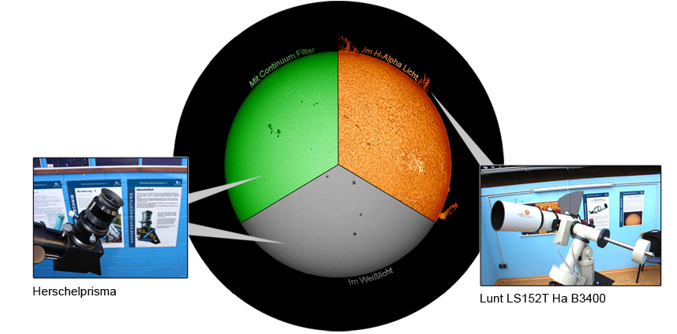

Erleben Sie die Sonne, wie Sie sie noch nie gesehen haben.  
Bei uns können Sie unseren Heimatstern in verschiedenen Wellenlänge beobachten.


**Coronabedingt findet zur Zeit keine Sonnenbeobachtung statt.**


### Öffnungszeiten: Sonntags, jeweils von 10:30 Uhr bis 13:00 Uhr

Anfang März bis Ende September: **Jeden Sonntag**  
Anfang Oktober bis Ende Februar: **Jeden zweiten** und **vierten Sonntag**


**Schauen Sie bitte _niemals_ ungeschützt in die Sonne!**


Auf der unten dargestellten Fotomontage sind die Wellenlängen aufgezeigt, wie sie mit unseren Filtern zu sehen sind.

Mit dem **Herschelprisma** im Weißlicht und mit Continuum-Filter im grünen Licht.  
Der **Kontinuum Filter** erhöht deutlich den Kontrast auf der Sonnenoberfläche und bei den Sonnenflecken.

Mit dem speziellen **Lunt Sonnenteleskop** sehen Sie die Protuberanzen am Rand der Sonne im H-Alpha Licht.

## Sonnenbeobachtung

Eine weitere Möglichkeit die Sonne zu beobachten ist die Sonnenprojektion.



Eine sehr sichere Beobachtungsmethode die den Vorzug hat, dass mehrere Personen gleichzeitig beobachten können. Dabei wird das Sonnenbild auf eine Projektionfläche hinter dem Okular abgebildet.
