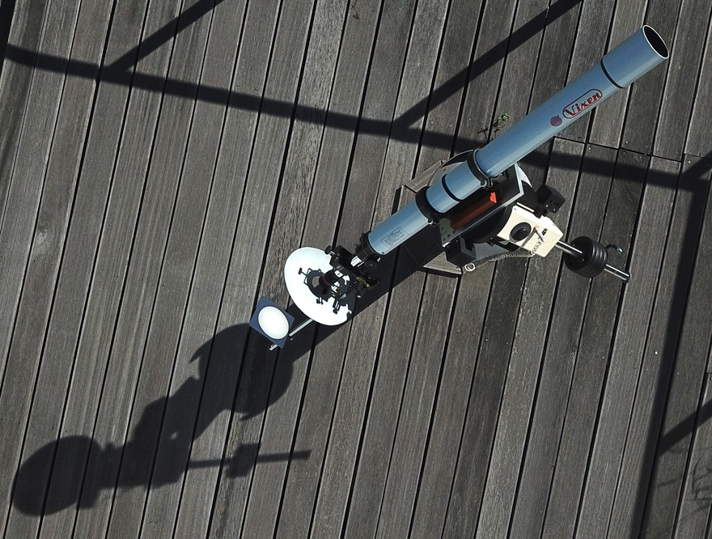

Wir bieten seit vielen Jahren die Möglichkeit, Sonnenbeobachtung unter professioneller Anleitung durchzuführen. Es können im sichtbaren Bereich des Spektrums der Sonne ihre Sonnenflecken und Protuberanzen betrachtet werden.


Schauen Sie bitte **niemals** ungeschützt in die Sonne!


Auf der unten dargestellten Fotomontage sind die Wellenlängen aufgezeigt, wie sie mit unseren Filtern zu sehen sind.

Mit dem **Herschelprisma** sieht man die Sonne im Weißlicht.  
Durch den **Continuum-Filter** ist die Sonne in grünem Licht zu sehen. Das erhöht deutlich den Kontrast auf der Sonnenoberfläche und bei den Sonnenflecken.  
Mit dem speziellen **Lunt Sonnenteleskop** sehen Sie die Protuberanzen am Rand der Sonne im H-Alpha Licht.

## Sonnenprojektion

Eine weitere Möglichkeit die Sonne zu beobachten ist die Sonnenprojektion. Es ist eine sehr sichere Beobachtungsmethode die den Vorzug hat, dass mehrere Personen gleichzeitig beobachten können. Dabei wird das Sonnenbild auf eine Projektionfläche hinter dem Okular abgebildet.



